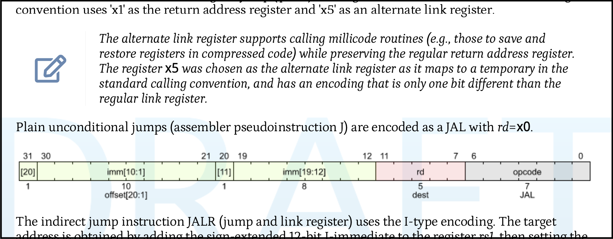

:source-highlighter: rouge
:sail-doc: sail_doc/doc.json

= Sail to Asciidoc
Alasdair Armstrong
:toc:

== Introduction

This document describes how to incorporate
https://github.com/rems-project/sail[Sail] source code into ISA
manuals written in asciidoc, using the
https://asciidoctor.org/[asciidoctor] tool. This is primarily aimed at
producing documentation for the
https://github.com/riscv/sail-riscv[sail-riscv] specification, but can
in principle be used for any ISA description written in Sail.

ISA specifications typically describe the behaviour of
instructions with a combination of prose, tables, diagrams, and
pseudocode for each instruction. Sail is a language intended to
support precise definition of real-world ISA semantics, enabling what
was previously just pseudocode to become executable and testable, while remaining readable for documentation. Sail supports
emulation for architectural compliance tests; it supports symbolic evaluation and the isla-axiomatic tooling for computing the allowed behaviour of relaxed-concurrency litmus tests, and it can generate
definitions for theorem provers (such ash https://coq.inria.fr/[Coq]
and https://isabelle.in.tum.de[Isabelle]) to support mechanised
reasoning over an ISA specification. Sail is a first-order imperative
language, with a syntax inspired by the existing pseudocode used in
various architecture manuals, and with influences from C and from modern programming
languages like Go, Swift, and Rust. The intent is it will therefore be
accessible to engineers familiar with existing ISA
pseudocode or with these languages.

Until now, we have had some ad-hoc methods to incorporate Sail source
into LaTeX documents, but here we present a more robust and extensible
system for incorporating Sail definitions into Asciidoc manuals. There
are two main components to this. First, there is an extension to Sail
which produces _documentation bundles_ -- files indexing the contents
of a Sail source file. Second, there is an asciidoctor plugin, which
uses these bundles to include Sail source code in asciidoc manuals
without duplicating the code, which would invariably lead to it
getting out of sync over time.

== A RISC-V example

Here we show how we can take a RISC-V instruction, and generate an
encoding diagram matching those used in the existing Asciidoc port of
the unpriv specification. We can also reference and typeset the Sail
source from the authoritative model, without requiring that it is simply
copy-pasted.

Consider the JAL instruction from the currently hand-written RISC-V
unpriv specification.

We can generate the same diagram from the Sail source code that
defines the JAL instruction:

include::sailwavedrom:encdec[left-clause="RISCV_JAL(_, _)",right,type=mapping]

Other than the opcode containing the actual bits, the automatically
generated image is almost identical. To generate this, we had to enter:

[source,adoc]
----
\include::sailwavedrom:encdec[left-clause="RISCV_JAL(_, _)",right,type=mapping]
----

Which accesses the encoding information contained in the following Sail:

[source,sail]
----
include::jal.sail[]
----

We can use an attribute in the Sail source to include information like
the labels that would otherwise not be included.

We can also include the (body of the) Sail function that defines the
JAL instruction using

[source,adoc]
----
sail::execute[clause="RISCV_JAL(_, _)",part=body,unindent]
----

This fetches the source code for the JAL instruction from the Sail
model, and typesets it in our Asciidoc document as follows:

sail::execute[clause="RISCV_JAL(_, _)",part=body,unindent]

== Documentation bundles

Documentation bundles are produced by Sail using the `-doc` flag. This
works like other Sail target flags, such as `-c` to generate C code,
`-coq` for Coq definitions, and so on. For example, if we have three
Sail files `a.sail`, `b.sail`, and `c.sail`, we could produce
documentation for them using:

[source,sh]
----
sail -doc a.sail b.sail c.sail
----

to produce only documentation for `c.sail` (which may still depend on
the other files), we can use:

[source,sh]
----
sail -doc a.sail b.sail c.sail -doc_file c.sail
----

The documentation bundle is a JSON file and will be placed in
`sail_doc/doc.json`. The output directory can be changed using the
`-o` option, so:

[source,sh]
----
sail -doc a.sail b.sail c.sail -doc_file c.sail -o my_doc
----

will produce a file `my_doc/doc.json`. See <<_sail_command_line_flags>> for other flags.

=== Potential workflows

The tooling has been carefully designed to not impose any particular workflow. You can:

* Generate the documentation bundle in advance and check it in. This
  means documentation contributors will not need Sail to build the
  documentation. This may lead the bundle becoming out of date, but
  there are various options here also:

  ** You can check if the bundle is up-to-date each time you build the document

  ** You can check if the bundle is up-to-date using some kind of continuous integration system

* Have a Makefile (or other build tool) generate the bundle every time
  the documentation is built.

These are only two possibilities. There are likely many others.

=== JSON format

The first few keys in the JSON file give information about the
documented Sail files, and the state of the repository they are
in. These keys can be accessed by custom build tooling to check if the
bundle is up to date. As an example:

[source,json]
----
{
  "version": 1,
  "git": {
    "commit": "773a19d17432a1c60cc95a87a587c8255bef9e75",
    "dirty": true
  },
  "embedding": "plain",
  "hashes": { "doc.sail": { "md5": "45ee16b971a5fc084bea556d83f27aff" } },
----

* The `version` key exists so the bundle format can be updated in the
  future. It is currently always set to 1.

* The `git` key contains the commit hash of the repository within
  which the `sail` command that produced the documentation bundle was
  produced. It also contains a flag that is true if the working tree
  has uncommitted changes. See
  https://mirrors.edge.kernel.org/pub/software/scm/git/docs/gitglossary.html#def_dirty
  for details.

* The `embedding` field tells us how other subsequent fields are
  encoded. See the `-doc_embed` option below for details.

* The hashes field contains a checksum for each Sail file included in
  the documentation bundle. Like the git commit hash it can be used by
  tools to check whether the bundle is up-to-date.

The rest of the file contains information for all the documented Sail
definitions.

=== Sail command line flags

* `-doc` -- Tells Sail to generate documentation.

* `-doc_file <file>` -- Include Sail definitions in `file` in the
  generated documentation bundle. This option can be passed multiple
  times. If `-doc_file` is not passed then all files provided to Sail
  will have documentation generated for them.

* `-doc_embed <plain|base64>` -- This option embeds the source code
  directly within the documentation bundle rather than referencing it
  from an external file. If `-doc_embed plain` is used then the source
  and comments is included as-is (with appropriate escaping to be
  included in a JSON file). With `-doc_embed base64` the source and
  comments are stored in the JSON as base64 encoded
  strings. `-doc_embed` is useful if you documentation is separate
  from the Sail source you are documenting.

* `-doc_compact` -- By default the JSON output is pretty-printed with
  indentation. When this option is used the JSON documentation bundle
  is printed in a compact form, omitting all unecessary spaces.

* `-doc_format <format>` -- This option controls the format for the
  output. Currently supported options are `adoc` and `asciidoc` (the
  default) which are the same and both output suitable for the Sail to
  Asciidoc plugin. Eventually `latex` will also be allowed once the
  older Sail to Latex documentation generation has been ported to the
  new documentation system written for this plugin.

* `-doc_bundle <file>` The name of the generated documentation bundle
  file. By default this is `doc.json`. It will be placed in the folder
  specified by the output `-o` option, which defaults to a folder
  named `sail_doc`.

=== Syntax highlighting

The Sail to Asciidoc plugin provides a lexer for rouge, an extensible
Ruby syntax highlighter supported by asciidoctor and
asciidoctor-pdf. If another highlighter with a fixed set of supported
languages is used, everything will still work, but without
highlighting.

== Asciidoc commands

The Sail to Asciidoc repository contains several examples
demonstrating the various commands in the `examples`
subdirectory. These examples are included below.

== Examples

=== Working with multiple Sail files

The documentation bundle is specified using an asciidoc attribute, for example:

[source,adoc]
----
:sail-doc: sail_doc/doc.json
----

Each command takes a `from` parameter which specifies which bundle to
pull the source from. This defaults to `from=sail-doc` if left
unspecified. In the following examples this is used for each separate
example, so you will see `from=<file>` which corresponds to a
documentation bundle generated in `examples/<file>.json`.

include::examples/function_body.adoc[]

include::examples/clauses.adoc[]

include::examples/mapping_clauses.adoc[]

include::examples/anchor.adoc[]

include::examples/span.adoc[]

include::examples/wavedrom.adoc[]

include::examples/split.adoc[]
